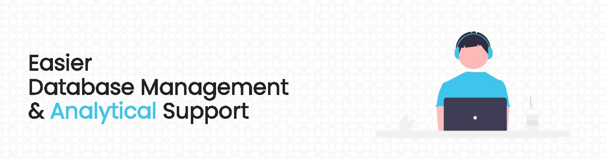

Maintaining a resourceful database is nowadays crucial for the development of an organization. But only database management isn't sufficient for that purpose. We need to represent them with proper analytics. There is so much going on in the background of such operations. That's why we, 'The AS8 Organization', took the initiative of creating a database management application that will help us to achieve their goals.

Only official authorities with proper permission can access this site. So, if you are not an official core-team member of The AS8 Organization, then this site is of no use for you.

 

# License
Details can be found in [LICENSE](LICENSE)
